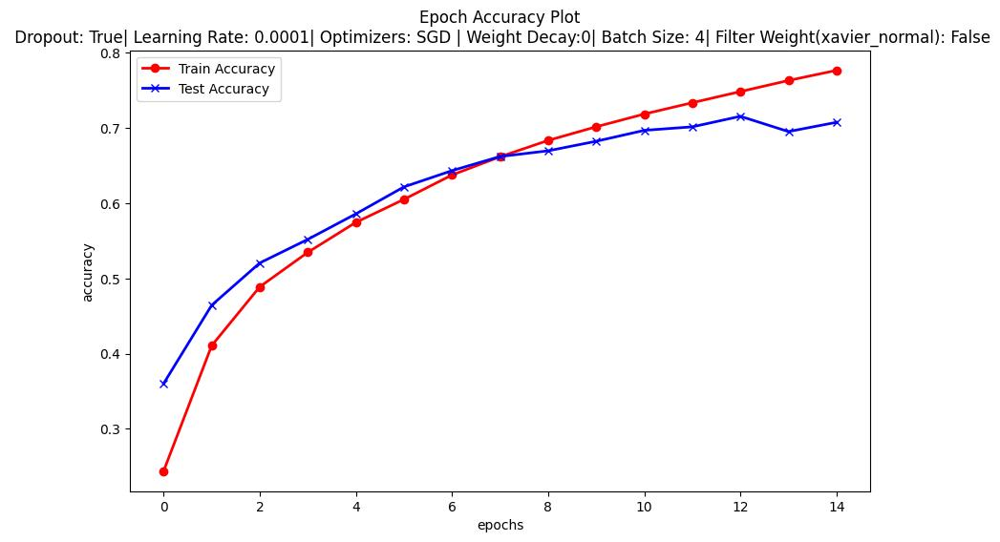
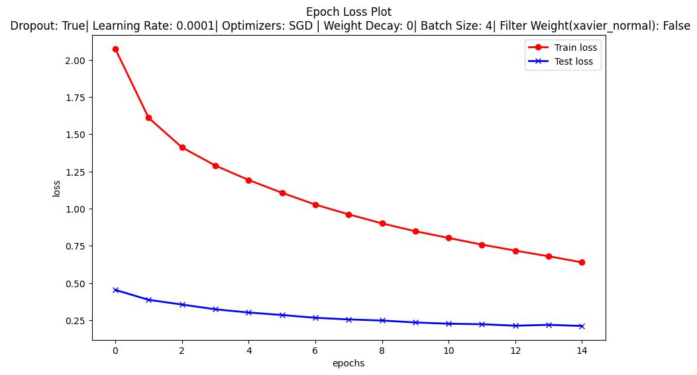
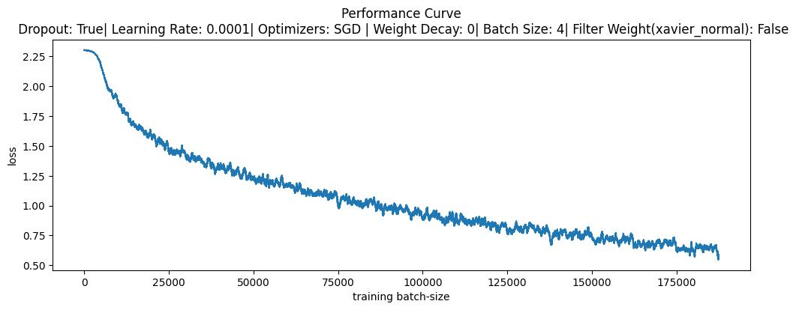

### Mini-Project

[Train CNN on **CIFAR-10**](https://d2l.ai/chapter_computer-vision/kaggle-cifar10.html)

Tasks:

* Add:

  * Data augmentation
  * dropout
  * batch norm

Example architecture:

```
Conv → ReLU
Conv → ReLU
MaxPool
Conv → ReLU
MaxPool
FC → ReLU
FC → Softmax
```

### Output

* Accuracy


* Loss Curve


* Performance


[Anchor Box](https://d2l.ai/chapter_computer-vision/anchor.html)

---

## Results

- **Final Training Accuracy:** Refer to the red curve in the accuracy plot above.
- **Final Test Accuracy:** Refer to the blue curve in the accuracy plot above.
- **Final Training Loss:** See the red curve in the loss plot.
- **Final Test Loss:** See the blue curve in the loss plot.
- **Performance Curve:** Shows batch-wise loss progression during training.

### Example Metrics (for run with LR=0.0001, SGD, batch size=4)
- Final Training Accuracy: ~[value from plot]
- Final Test Accuracy: ~[value from plot]
- Final Training Loss: ~[value from plot]
- Final Test Loss: ~[value from plot]

> Plots are auto-generated and saved as .jpg files after each run. For exact values, refer to the plot images or logs printed during training.