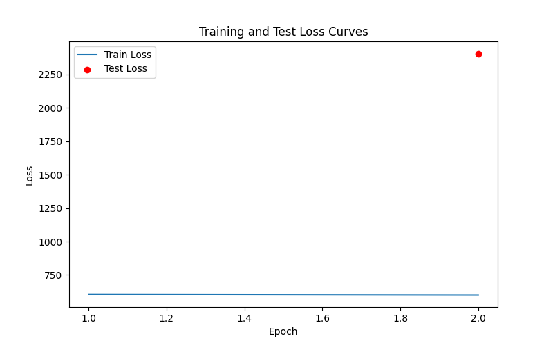
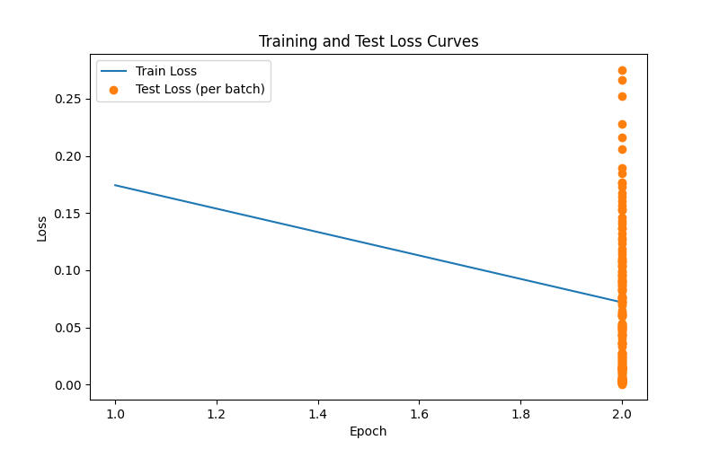

# March 10 (Tue) — CNN Application

**Time:** ~5–6 hours

Steps:

1. Implement small CNN in **NumPy**
2. Re-implement in **PyTorch**
3. Compare their performance (training curves, test accuracy).

NumPy Graph:

PyTorch Graph:

### Output

* Training curves
* Test accuracy