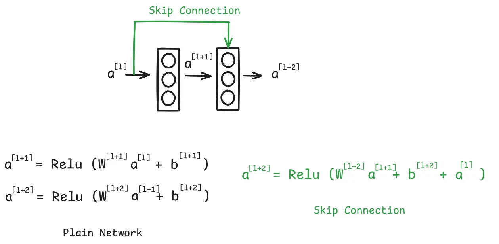
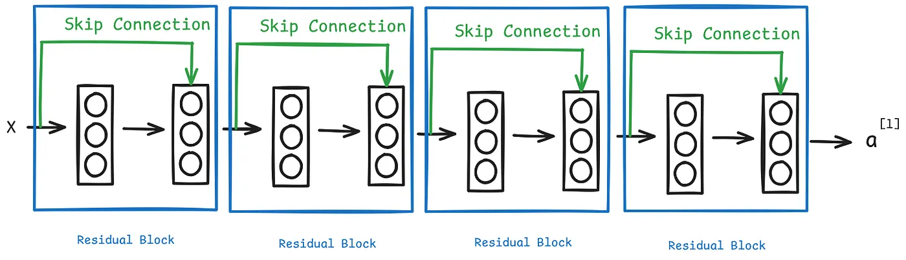

# [**He et al. (2016)** — Deep Residual Learning for Image Recognition ; ResNet (skip connections)](https://arxiv.org/pdf/1512.03385)

Neural Networks face severe limitations when the data is images. For image-related tasks, **Convolutional Neural Networks (CNNs)** are used because they greatly reduce computational complexity and exploit spatial structure in images.

Over time, CNN architectures evolved:

* **LeNet** → early CNN for digit recognition
* **AlexNet** → large-scale deep CNN trained on ImageNet
* **VGG** → deeper networks with stacked small convolutions
* **GoogLeNet** → multi-branch architectures (Inception modules)
* **ResNet** → introduced **skip connections** enabling very deep networks

Among these, **ResNet is considered the first truly modern CNN architecture**, because it introduced a new structural component: **Residual Connections (Skip Connections)**.

These connections fundamentally changed how deep neural networks are optimized.

In this document we discuss:

* Residual Networks (ResNet)
* Skip Connections
* Residual Blocks
* Variants such as **ResNeXt** and **DenseNet**
* Modern CNN architecture design principles

---

# ResNet (Residual Network)

The primary contribution of ResNet is the **Residual Block**, which introduces the **Skip Connection**.

In traditional feed-forward neural networks:

```
Layer1 → Layer2 → Layer3 → Layer4
```

Each layer only connects to the next one.

ResNet modifies this structure by allowing information to **skip layers**.

---

## Skip Connection



Skip connections allow information to jump over one or more layers.

Mathematically:

[
y = F(x) + x
]

where

* (x) = input
* (F(x)) = transformation learned by layers
* (y) = output

Instead of learning a direct mapping (H(x)), the network learns a **residual function**:

[
F(x) = H(x) - x
]

This formulation makes optimization much easier.

---

# Residual Blocks



Residual blocks are the **building blocks of ResNet**.

Each block consists of:

```
Input
 ↓
Conv → BN → ReLU
 ↓
Conv → BN
 ↓
Add Skip Connection
 ↓
ReLU
```

The input is added directly to the output of the convolution layers.

---

# Why Residual Blocks Work

## Vanishing Gradient Problem

Training deep neural networks requires backpropagation of gradients.

However, as networks become deeper:

* gradients may **vanish** (become extremely small)
* gradients may **explode**

When gradients vanish:

* early layers stop learning
* optimization becomes unstable

---

## Skip Connections Improve Gradient Flow

Residual connections create **shortcut paths** for gradient flow.

Instead of passing through many nonlinear transformations, gradients can propagate through identity mappings.

This greatly stabilizes training.

---

## Residual Learning

Instead of learning:

[
H(x)
]

the network learns:

[
F(x) = H(x) - x
]

and outputs

[
H(x) = F(x) + x
]

Learning residuals is often easier because:

* many transformations are close to identity
* the network only needs to learn small adjustments

Example intuition:

Editing a sentence:

* rewriting entire sentence → difficult
* correcting mistakes → easier

Residual learning follows the same idea.

---

## Avoiding Performance Degradation

Plain deep networks often suffer from **degradation**:

```
deeper network → higher training error
```

Even when overfitting is not the issue.

Residual networks solve this.

If additional layers are unnecessary:

```
F(x) = 0
```

Then

```
y = x
```

So the network behaves like an identity function.

Thus **adding layers cannot degrade performance**.

---

## Benefits of Residual Blocks

* Solves **vanishing gradient problem**
* Enables **very deep networks**
* Faster convergence
* Identity mapping capability
* Improved optimization stability

---

# ResNet Architectures

ResNet variants are named by the number of layers.

Common versions:

| Model      | Layers |
| ---------- | ------ |
| ResNet-18  | 18     |
| ResNet-34  | 34     |
| ResNet-50  | 50     |
| ResNet-101 | 101    |
| ResNet-152 | 152    |

ResNet-152 achieved **3.57% top-5 error on ImageNet**.

Researchers even trained networks with **1202 layers** without degradation.

---

# Residual Block Types

There are two main residual block types.

---

## Identity Block

Used when **input and output dimensions are the same**.

Structure:

```
Input
 ↓
Conv → BN → ReLU
 ↓
Conv → BN
 ↓
Add Input
 ↓
ReLU
```

Shortcut path:

```
identity
```

---

## Convolutional Block

Used when **dimensions change**.

Shortcut path uses a **1×1 convolution** to match dimensions.

Structure:

```
Input
 ↓
Conv → BN → ReLU
 ↓
Conv → BN
 ↓
Add (1×1 Conv Shortcut)
 ↓
ReLU
```

---

# Practical Implementation (PyTorch Example)

### Residual Block

```python
class Residual(nn.Module):
  def __init__(self, num_channels, use_1x1conv=False, strides=1):
    super().__init__()
    self.conv1 = nn.LazyConv2d(num_channels, kernel_size=3, padding=1, stride=strides)
    self.conv2 = nn.LazyConv2d(num_channels, kernel_size=3, padding=1)

    if use_1x1conv:
      self.conv3 = nn.LazyConv2d(num_channels, kernel_size=1, stride=strides)
    else:
      self.conv3 = None

    self.bn1 = nn.LazyBatchNorm2d()
    self.bn2 = nn.LazyBatchNorm2d()

  def forward(self, X):
    Y = F.relu(self.bn1(self.conv1(X)))
    Y = self.bn2(self.conv2(Y))

    if self.conv3:
      X = self.conv3(X)

    Y += X
    return F.relu(Y)
```

---

# Building a ResNet Model

```python
class ResNet(d2l.Classifier):
  def b1(self):
    return nn.Sequential(
      nn.LazyConv2d(64, kernel_size=7, stride=2, padding=3),
      nn.LazyBatchNorm2d(),
      nn.ReLU(),
      nn.MaxPool2d(kernel_size=3, stride=2, padding=1)
    )

  def block(self, num_residuals, num_channels, first_block=False):
    blk = []

    for i in range(num_residuals):
      if i == 0 and not first_block:
        blk.append(Residual(num_channels, use_1x1conv=True, strides=2))
      else:
        blk.append(Residual(num_channels))

    return nn.Sequential(*blk)
```

---

# ResNeXt: Improving ResNet

ResNeXt extends ResNet by introducing **grouped convolutions**.

Instead of one large convolution:

```
Conv
```

ResNeXt splits channels into groups:

```
Group Conv1
Group Conv2
Group Conv3
```

Advantages:

* better accuracy
* fewer parameters
* lower computation

---

## ResNeXt Block (PyTorch)

```python
class ResNeXtBlock(nn.Module):
  def __init__(self, num_channels, groups, bot_mul, use_1x1conv=False, strides=1):
    super().__init__()

    bot_channels = int(round(num_channels * bot_mul))

    self.conv1 = nn.LazyConv2d(bot_channels, kernel_size=1)
    self.conv2 = nn.LazyConv2d(bot_channels, kernel_size=3,
                               stride=strides, padding=1,
                               groups=bot_channels//groups)
    self.conv3 = nn.LazyConv2d(num_channels, kernel_size=1)

    self.bn1 = nn.LazyBatchNorm2d()
    self.bn2 = nn.LazyBatchNorm2d()
    self.bn3 = nn.LazyBatchNorm2d()
```

---

# DenseNet: Feature Reuse

DenseNet further extends the idea of cross-layer connections.

Instead of **adding outputs**:

```
Y = X + F(X)
```

DenseNet **concatenates features**:

```
Y = [X, F(X)]
```

This allows:

* feature reuse
* stronger gradient flow

---

### Dense Block

```python
class DenseBlock(nn.Module):
  def __init__(self, num_convs, num_channels):
    super().__init__()

    layer = []

    for i in range(num_convs):
      layer.append(conv_block(num_channels))

    self.net = nn.Sequential(*layer)

  def forward(self, X):
    for blk in self.net:
      Y = blk(X)
      X = torch.cat((X, Y), dim=1)

    return X
```

---

# Designing Convolution Network Architectures (D2L 8.8)

Modern CNN architectures evolved through several major innovations:

| Architecture        | Key Idea                      |
| ------------------- | ----------------------------- |
| AlexNet             | Deep CNN + GPU training       |
| VGG                 | Stacked (3×3) convolutions    |
| NiN                 | (1×1) convolutions            |
| GoogLeNet           | Multi-branch architectures    |
| ResNet              | Residual connections          |
| ResNeXt             | Grouped convolutions          |
| DenseNet            | Dense feature connections     |
| SENet               | Channel attention             |
| Vision Transformers | Attention-based vision models |

---

# AnyNet Design Space

Modern networks can be represented using a **common structure**:

```
Stem → Body → Head
```

### Stem

Initial processing of input image.

```
Conv → BN → ReLU
```

---

### Body

Consists of multiple **stages**, each containing several blocks.

Each stage:

* reduces spatial resolution
* increases number of channels

---

### Head

Final classification layers.

```
Global Average Pool
 ↓
Fully Connected
 ↓
Softmax
```

---

# RegNet: Systematic CNN Design

Instead of manually designing networks, **RegNet** proposes simple design principles.

Key rules:

* share **bottleneck ratio** across stages
* share **group width**
* increase **channels across stages**
* increase **depth across stages**

This produces families of networks with predictable performance.

---

### Example: RegNetX32

```python
class RegNetX32(AnyNet):
  def __init__(self, lr=0.1, num_classes=10):
    stem_channels, groups, bot_mul = 32, 16, 1
    depths, channels = (4, 6), (32, 80)

    super().__init__(
      ((depths[0], channels[0], groups, bot_mul),
       (depths[1], channels[1], groups, bot_mul)),
      stem_channels, lr, num_classes)
```

---

# The Big Picture: CNNs to Transformers

CNNs dominated computer vision for nearly a decade because of strong **inductive biases**:

* locality
* translation invariance

However, **Vision Transformers** now outperform CNNs on large datasets.

Reason:

* scalability
* attention mechanisms
* massive datasets

Example datasets:

* LAION-400M
* LAION-5B

Modern vision models now combine ideas from both CNNs and Transformers.

---

# Key Takeaways

* Deep networks are powerful but hard to train.
* **Residual connections enable very deep networks.**
* Identity mappings make optimization easier.
* ResNeXt improves efficiency using grouped convolutions.
* DenseNet maximizes feature reuse through concatenation.
* Modern architecture design spaces (AnyNet, RegNet) allow systematic exploration of CNNs.
* Vision Transformers are now pushing beyond traditional CNN architectures.